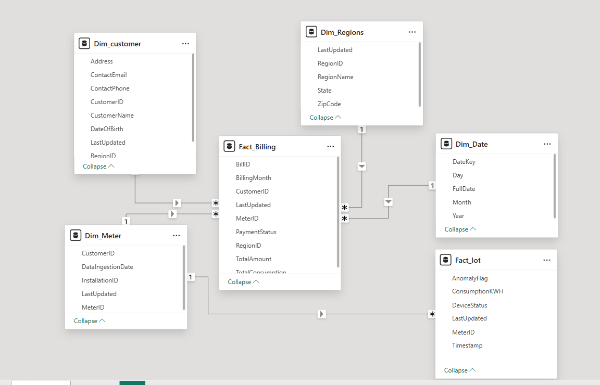

# Energy_Data_Syanpse_Analytics_Project-
## Inroduction
This repository contains an end-to-end energy data engineering pipeline built using Azure Synapse Analytics, Azure Data Factory, Delta Lake, and Power BI. The project is designed to process, transform, and analyze real-time and batch energy consumption data to derive meaningful insights for energy management, anomaly detection, and operational optimization.
## Architecture 

## 🛠️ Technologies Used

This project utilizes **Azure Synapse Analytics, Databricks, Power BI, and other Microsoft Azure services** to efficiently process and analyze energy consumption data.

| **Technology**        | **Purpose** |
|----------------------|------------|
| **Azure Data Lake Storage Gen2 (ADLS)** | Stores raw, unstructured, and structured data from multiple sources. |
| **Azure Data Factory (ADF)** | Orchestrates and automates batch ingestion pipelines. |
| **Azure Database ** | Handles Customer related  data from  Azure Database. |
| **Azure Synapse Analytics** | Performs bat
| **Azure Event Hubs** | Handles real-time streaming data from IoT devices (Smart Meters). |
| **Power BI** | Visulization |

## Dataset Used
This project utilizes synthetically generated datasets to simulate real-world energy consumption and customer billing scenarios. The data was auto-generated using a Python script to create realistic energy usage patterns. The datasets include customer billing information, regional mappings, and IoT-based smart meter readings.
https://github.com/Rajdeepkaurbhele/Energy_Data_Syanpse_Analytics_Project-/blob/main/customers_data.csv
https://github.com/Rajdeepkaurbhele/Energy_Data_Syanpse_Analytics_Project-/blob/main/outages_data.csv
https://github.com/Rajdeepkaurbhele/Energy_Data_Syanpse_Analytics_Project-/blob/main/regions_data.csv
https://github.com/Rajdeepkaurbhele/Energy_Data_Syanpse_Analytics_Project-/blob/main/Azure%20SQL%20.png
33 DATA model
The following diagram represents the data model used in this project.

## Script Used 
https://github.com/Rajdeepkaurbhele/Energy_Data_Syanpse_Analytics_Project-/blob/main/BronzeToSilver.ipynb
https://github.com/Rajdeepkaurbhele/Energy_Data_Syanpse_Analytics_Project-/blob/main/SilvertoGold.ipynb
https://github.com/Rajdeepkaurbhele/Energy_Data_Syanpse_Analytics_Project-/blob/main/Meta_Deta_Table.ipynb

